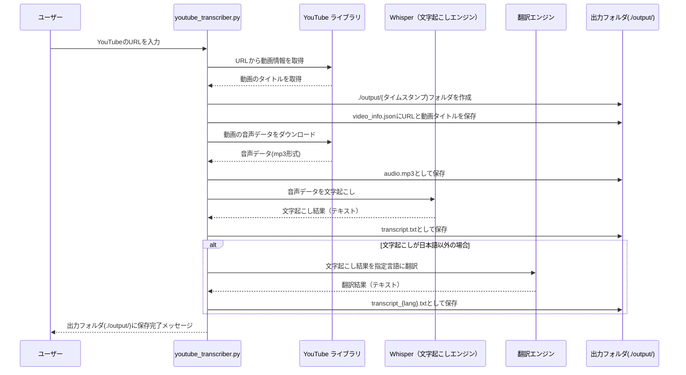

# シーケンス図

```mermaid
sequenceDiagram
    participant User as ユーザー
    participant Script as youtube_transcriber.py
    participant YouTube as YouTube ライブラリ
    participant Whisper as Whisper（文字起こしエンジン）
    participant Translate as 翻訳エンジン
    participant Output as 出力フォルダ(./output/)

    User->>Script: YouTubeのURLを入力
    Script->>YouTube: URLから動画情報を取得
    YouTube-->>Script: 動画のタイトルを取得

    Script->>Output: ./output/{タイムスタンプ}フォルダを作成
    Script->>Output: video_info.jsonにURLと動画タイトルを保存

    Script->>YouTube: 動画の音声データをダウンロード
    YouTube-->>Script: 音声データ(mp3形式)
    Script->>Output: audio.mp3として保存

    Script->>Whisper: 音声データを文字起こし
    Whisper-->>Script: 文字起こし結果（テキスト）
    Script->>Output: transcript.txtとして保存

    alt 文字起こしが日本語以外の場合
        Script->>Translate: 文字起こし結果を指定言語に翻訳
        Translate-->>Script: 翻訳結果（テキスト）
        Script->>Output: transcript_{lang}.txtとして保存
    end

    Script-->>User: 出力フォルダ(./output/)に保存完了メッセージ
```
